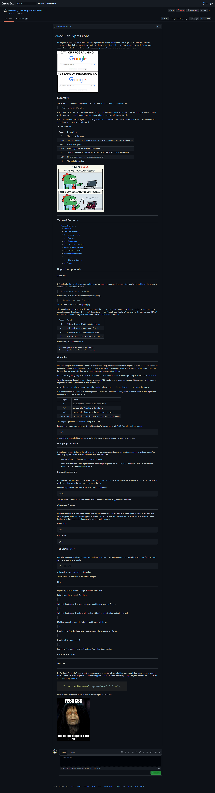

## Regex Tutorial - Steve Barry

##  The Task

The task was to create a tutorial that explains how a specific regular expression, or regex, functions by breaking down each part of the expression and describing what it does.

### ⭐ ⭐ S.T.A.R. ⭐ ⭐

**SITUATION**

The provided user story was: 

> AS A web developer student
> 
> I WANT a tutorial explaining a specific regex
>
> SO THAT I can understand the search pattern the regex defines

**TASK**

Provide a tutorial explaining a specific regex.

**ACTION**

Writing of a tutorial to resolve the situation, including:
* Design
  * *Structured layout*
  * *Easy to read and follow design*
* Content
  * *Researched content*
  * *Mixed with humour for easier understanding*
  * *Thorough breakdown of example regex*
* GIT
  * *Numerous commits to track changes in code*
  * *Gist available for public viewing*

**RESULT**

The end result is displayed to a Github Gist and publicly available and viewable. This result meets all requirements of the User Story and acceptance criteria:

* ~~GIVEN a regex tutorial~~
* ~~WHEN I open the tutorial~~
* ~~THEN I see a descriptive title and introductory paragraph explaining the purpose of the tutorial, a summary describing the regex featured in the tutorial, a table of contents linking to different sections that break down each component of the regex and explain what it does, and a section about the author with a link to the author’s GitHub profile~~
* ~~WHEN I click on the links in the table of contents~~
* ~~THEN I am taken to the corresponding sections of the tutorial~~
* ~~WHEN I read through each section of the tutorial~~
* ~~THEN I find a detailed explanation of what a specific component of the regex does~~
* ~~WHEN I reach the end of the tutorial~~
* ~~THEN I find a section about the author and a link to the author’s GitHub profile~~

##  The Outcome

As the acceptance criteria has been met and the task is now complete. 

You can view the Github gist here [HERE](https://gist.github.com/NBS5000/73932a4289864f9ca10529dc7d867426)

Alternatively, here is a screenshot:

> 

---

Written by Steve Barry - Due date 4/04/2022

© 2021 Trilogy Education Services, LLC, a 2U, Inc. brand. Confidential and Proprietary. All Rights Reserved.

