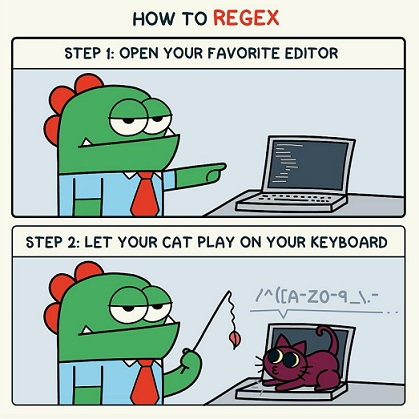

# Regular Expressions

Ah, Regular Expressions, the expressions used regularly that no one understands. The magic bit of code that looks like someone mashed their keyboard. Once you know what you're looking at, it does start to make sense. A bit like most other code, when you think about it. That said, most developers don't know how to write their own regex:

 
## Summary

The function of the regex I'll be going through is this:

> ^[^\s@]+@[^\s@]+\.[^\s@]+$

No, my child didn't decide to play *work* on my laptop. It actually makes sense, and it checks the formatting of emails. I know it works, because I copied and pasted it into one of my projects and it works. 

It isn't the finest example of regex, nor does it guarantee that an email address is valid, just that its basic structure meets the super basic string pattern we've stipulated. 

Breaking it down, the first part: ^[^\s@]

| Regex | Description |
| :---: | :---- |
| ^ | The start of the string |
| [^\s@] | Searches for any characters that *aren't* whitespace characters (\s)or the @ character|
| +@ | then the @ symbol |
| [^\s@] | No change from the previous description |
| +\. | Then checks for a dot. As the dot is a special character, it needs to be escaped |
| [^\s@] | No change in code = no change in description |
| +$ | The end of the string |

------------------------------------------------

------------------------------------------------

## Table of Contents

- [Regular Expressions](#regular-expressions)
  - [Summary](#summary)
  - [Table of Contents](#table-of-contents)
  - [Regex Components](#regex-components)
  - [### Anchors](#-anchors)
  - [### Quantifiers](#-quantifiers)
  - [### Grouping Constructs](#-grouping-constructs)
  - [### Bracket Expressions](#-bracket-expressions)
  - [### Character Classes](#-character-classes)
  - [### The OR Operator](#-the-or-operator)
  - [### Flags](#-flags)
  - [### Character Escapes](#-character-escapes)
  - [## Author](#-author)

## Regex Components

### Anchors
------------------------------------------------
Left and right, right and left: it makes a difference. Anchors are characters that are used to specify the position of the pattern in relation to the line of text it sits in:

> ^ is the anchor for the start of the line

In the example above, the start of the regex is: ^[^\s@]

> $ is the anchor for the end of the line

And the end of the code is this: [^\s@]+$

The order in which these are typed is important too, the ^ must be the first character, the $ must be the last is the section of string being searched. Typing 'S^' doesn't do anything special, it simply searches for S^ anywhere in the line. Likewise, '$S' isn't special either, it'll find $S anywhere in the line. Here is a table that may explain:

 | Regex  | Result   | 
 | :----: | :------- |
 |  ^X    | Will search for an 'X' at the start of the line |
 |  X$    | Will search for an 'X' at the end of the line |
 |  X^    | Will search for an 'X' anywhere in the line. |
 |  $X    | Will also search for an 'X' anywhere in the line |

In the example given at the [start](#summary):

    ^ asserts position at start of the string
    $ asserts position at the end of the string

### Quantifiers
------------------------------------------------
Quantifiers stipulates how many instances of a character, group, or character class must be present in the line for a match to be identified. This may sound simple and straightforward, but it's not. Quantifiers can be like partners you don't want.... they can be lazy, they can be greedy, they can even be possessive, amongst other things. 

At a default, regex is greedy. It will match as many instances in a line as possible and the greedy part is essential in the match.

When lazy, regex will match as few instances as possible. This can be zero or more; for example if the next part of the current regex search matches, then the lazy part isn't essential.

Possessive regex will take a character it matches, and the character cannot be matched in the next part of the search.

Generally speaking, a quantifier tells the regex engine to match a specified quantity of the character, token or sub-expression immediately to its left. For instance:

 | Regex  | Result   | 
 | :----: | :------- |
 |  X+    | the quantifier + applies to the character X |
 |  \x*   | the quantifier * applies to the token \x |
 |  star? | the quantifier ? applies to the character r, *not* to star |
 |  (?:star,\|wars,)+ | the quantifier + applies to the sub-expression (?:star,\|wars,) |

The simplest quantifier is a number in curly braces: {n}: 

For example, you can search for exactly 3 of the string '\x' by searching with \x{3}. This will match the string:

    \x\x\x

A quantifier is appended to a character, a character class, or a set and specifies how many we need.

### Grouping Constructs
------------------------------------------------
Grouping constructs allows you to combine a sequence of literals and pattern characters with a quantifier to find repeating or optional matches. 

There's not too much more to it than this, a grouped construct is a sub-expression within the regex.

### Bracket Expressions
------------------------------------------------
A bracket expression is a list of characters enclosed by [ and ]. It matches any single character in that list. If the first character of the list is ^, then it matches any character not in the list

In the example above, the same grouping construct is used a few times: [^\s@]

This grouping searches for characters that *aren't* whitespace characters (\s)or the @ character.

### Character Classes
------------------------------------------------
Similar to the above, a character class matches any one of the enclosed characters. You can specify a range of characters by using a hyphen, but if the hyphen appears as the first or last character enclosed in the square brackets it is taken as a literal hyphen to be included in the character class as a normal character.

For example [xyz] is the same as [x-z].

### The OR Operator
------------------------------------------------
Much like OR operators in other languages and logical operators, the OR operator in regex works by searching for either one value or another. For example:

[K|C]+atherine 

will match to either Katherine or Catherine.

There are no OR operators in the above example.

### Flags
------------------------------------------------
Regular expressions may have flags that affect the search.

In JavaScript there are only 6 of them:

>i

With this flag the search is case-insensitive: no difference between A and a.

>g

With this flag the search looks for all matches, without it – only the first match is returned.

>m

Multiline mode. This only affects how ^ and $ anchors behave.

>s

Enables “dotall” mode, that allows a dot . to match the newline character \n 

>u

Enables full Unicode support.

>y

Searching at an exact position in the string. Also called 'Sticky mode'.

### Character Escapes
------------------------------------------------

## Author
------------------------------------------------
Hi, I'm Steve. A guy who's been a software developer for a number of years, but has recently switched tracks to focus on web development. I love creating solutions and solving puzzles. If you're interested in any of my work, feel free to have a look at my [Github](https://github.com/NBS5000/), or at my [portfolio](https://nbs5000.github.io/portfolio3/).

I'm also a Star Wars nerd, you may or may not have picked up on that.

